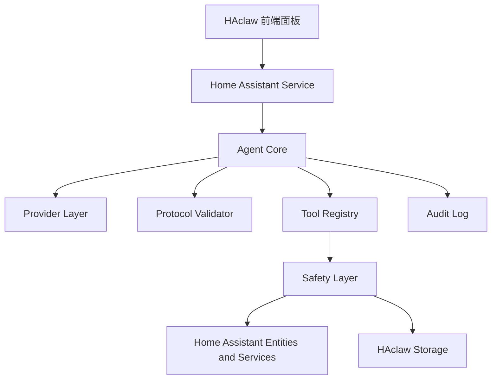

# HAclaw

HAclaw 是一个面向中文用户的 Home Assistant AI Agent 插件，目标是让用户可以用自然语言更安全地控制智能家居、生成自动化草稿、理解 Home Assistant 配置，并更好地适配国内大模型和小米 / 米家 / MIoT 生态。小米 MiMo 模型支持是 HAclaw v1.0 的重点卖点之一。

> 一句话定位：HAclaw，用中文控制 Home Assistant 的 AI 爪子。

## 项目状态

当前已进入 v1.0 开发阶段。第一批代码先落在可测试的安全地基上：Home Assistant 自定义集成骨架、统一 OpenAI-compatible provider、严格 JSON Agent 协议、服务风险分类和 Xiaomi 实体识别辅助。

| 路径 | 用途 |
| --- | --- |
| `README.md` | 项目说明、功能范围、架构方向和路线图 |
| `AGENTS.md` | 编码 Agent 和贡献者必须遵守的技术护栏 |
| `custom_components/haclaw/` | Home Assistant 自定义集成代码 |
| `tests/` | v1.0 核心安全能力的单元测试 |

当前验证命令：

```bash
scripts/run_tests.sh
~/.venvs/haclaw-ha/bin/hass --script check_config -c ~/.ha-dev/haclaw
```

## 本地开发环境

HAclaw 是 Home Assistant 自定义集成。推荐优先使用 Home Assistant 官方 devcontainer；如果本机没有 Docker，也可以使用本仓库的本地 venv 脚本。

当前本地脚本默认使用 Homebrew Python 3.14：

```bash
scripts/setup_ha_dev_env.sh
```

脚本会完成：

- 创建 `~/.venvs/haclaw-ha`
- 安装 `homeassistant`、`pytest`、`pytest-homeassistant-custom-component`
- 创建 `~/.ha-dev/haclaw`
- 将当前仓库的 `custom_components` 软链到 HA 配置目录

运行基础测试：

```bash
scripts/run_tests.sh
```

运行 Home Assistant 配置检查：

```bash
~/.venvs/haclaw-ha/bin/hass --script check_config -c ~/.ha-dev/haclaw
```

启动本地 Home Assistant：

```bash
scripts/run_hass_dev.sh
```

启动后打开：

```text
http://localhost:8123
```

首次进入 HA UI 后，在“设置 -> 设备与服务 -> 添加集成”中搜索 `HAclaw`。测试配置时可以填入任意 OpenAI-compatible 服务商的 API key、Base URL 和模型；连接测试会在后端执行，错误会脱敏显示。

## 为什么做 HAclaw

Home Assistant 很强，但中文用户在实际使用中经常遇到几个痛点：

- 设备、实体、区域、服务名称混杂，中文自然语言不容易准确映射到真实实体。
- 国内模型服务商很多，Xiaomi MiMo、DeepSeek、Qwen、Kimi、GLM、硅基流动、OneAPI、New API 等配置方式各不相同。
- 小米、米家、Aqara、Yeelight、Roborock、Dreame 等设备常通过不同集成进入 HA，实体识别和控制路径不统一。
- 自动化和配置文件一旦写错，可能影响真实家庭环境，必须可预览、可确认、可回滚。

HAclaw 的目标不是让 AI 获得无限权限，而是做一个中文优先、安全优先、可审计的 Home Assistant Copilot。

## v1.0 核心目标

1. 国内模型适配：通过统一 OpenAI-compatible 客户端支持主流国内模型和自建网关，其中 Xiaomi MiMo 作为重点 Provider preset。
2. 中文优先体验：优先匹配 `friendly_name`、区域、别名、厂商、型号和集成来源。
3. 小米生态增强：通过 Home Assistant 实体和服务识别 Xiaomi / Mi Home / MIoT / Aqara / Yeelight / Roborock / Dreame 设备。
4. 图形化模型接入：不同 LLM 的 API key、Base URL、模型名称和连接测试必须能通过 UI 或对话向导完成。
5. 安全设备控制：常见低风险设备可以在明确意图下执行，高风险操作必须确认。
6. 自动化草稿：根据中文描述生成自动化草稿，校验后预览，不默认静默启用。
7. 配置辅助：可以解释和诊断配置，但修改配置必须有 diff、备份、校验和确认。

## 非目标

v1.0 不做这些事情：

- 不把 HAclaw 做成不受限制的 AI root user。
- 不直接请求或保存小米云 token。
- 不直接调用任意小米云 API。
- 不让模型自由调用任意 Home Assistant service。
- 不要求普通用户为了接入 LLM 手动修改 YAML、JSON、`.storage` 或其他配置文件。
- 不直接修改 `.storage/core.config_entries` 等 Home Assistant 内部存储。
- 不静默修改 `configuration.yaml`、`automations.yaml`、`scripts.yaml` 等用户核心文件。
- 不自动解锁门锁、解除报警、重启 Home Assistant 或执行系统命令。

## 典型用户场景

### 控制设备

用户输入：

```text
打开客厅灯
```

HAclaw 应该：

1. 查找 `客厅` 区域。
2. 匹配灯光实体。
3. 如果只有一个高置信度候选，执行安全工具。
4. 如果有多个候选，让用户选择。

### 小米设备控制

用户输入：

```text
打开米家空气净化器
```

HAclaw 应该：

1. 优先调用小米实体发现能力。
2. 从 Home Assistant 实体、设备注册表、区域、厂商、型号和集成信息中匹配。
3. 优先使用标准 HA 服务，例如 `fan.turn_on`。
4. 标准服务无法满足时，再考虑 `xiaomi_miot` 或 `xiaomi_miio` 专用服务。

### 自动化草稿

用户输入：

```text
每天晚上 7 点打开客厅空气净化器，晚上 11 点关闭
```

HAclaw 应该：

1. 识别空气净化器实体。
2. 生成自动化草稿。
3. 校验实体、服务、触发器和动作。
4. 标记风险等级。
5. 在前端展示草稿。
6. 经过用户确认后，写入 HAclaw 管理的自动化文件。
7. 默认禁用或明确要求用户手动启用。

### 高风险操作

用户输入：

```text
我到家就自动打开门锁
```

HAclaw 应该：

1. 标记为高风险。
2. 解释自动开锁的风险。
3. 不直接创建自动化。
4. 建议更安全的替代方案，例如到家时发送通知，由用户手动确认开锁。

## 总体架构

HAclaw 推荐采用自定义 Home Assistant integration + 自定义侧边栏面板的方式。



关键原则：

- 模型只提出意图、工具调用或草稿。
- 协议校验层只接受合法 JSON。
- 工具层只暴露类型化工具，不暴露任意 HA 内部能力。
- 安全层负责风险分级、确认要求和阻断。
- Home Assistant 始终是设备、实体、服务和状态的来源。

## 推荐目录结构

```text
custom_components/haclaw/
├── __init__.py
├── manifest.json
├── const.py
├── config_flow.py
├── services.yaml
├── strings.json
├── agent/
│   ├── core.py
│   ├── protocol.py
│   ├── prompts.py
│   ├── memory.py
│   └── safety.py
├── providers/
│   ├── base.py
│   ├── openai_compatible.py
│   ├── anthropic.py
│   ├── gemini.py
│   └── local.py
├── tools/
│   ├── registry.py
│   ├── entity.py
│   ├── service.py
│   ├── automation.py
│   ├── dashboard.py
│   ├── xiaomi.py
│   ├── history.py
│   └── diagnostics.py
├── storage/
│   ├── drafts.py
│   └── audit_log.py
├── frontend/
│   └── haclaw-panel.js
└── translations/
    ├── zh-Hans.json
    └── en.json
```

## 国内模型适配

HAclaw v1.0 的默认策略是使用一个共享的 `OpenAICompatibleClient`，不要为每个国内模型重复写一套客户端。

| Provider | 默认 Base URL | 模型配置 |
| --- | --- | --- |
| Xiaomi MiMo | `https://api.mimo-v2.com/v1` 或用户配置 | `mimo-v2-flash`、`mimo-v2-pro`、`mimo-v2-omni` 等，以官方控制台为准 |
| DeepSeek | `https://api.deepseek.com` | 用户可选或自定义 |
| Qwen / DashScope | `https://dashscope.aliyuncs.com/compatible-mode/v1` | 用户可选或自定义 |
| Kimi / Moonshot | `https://api.moonshot.cn/v1` 或 `https://api.moonshot.ai/v1` | 用户可选或自定义 |
| GLM / Zhipu | OpenAI-compatible endpoint | 用户可选或自定义 |
| SiliconFlow | `https://api.siliconflow.cn/v1` | 用户自定义 |
| OneAPI / New API | 用户配置 | 用户自定义 |
| 自建网关 | 用户配置 | 用户自定义 |

模型名称变化较快，所有预设都只能作为便利默认值，用户必须能修改 Base URL 和 Model。

配置项建议：

- Provider preset
- API key
- Base URL
- Model
- Timeout
- Temperature
- Top P
- Optional custom headers

错误提示需要能区分：

- API key 无效
- Base URL 不可访问
- 模型不存在
- 限流
- 超时
- 上下文长度超限
- JSON 解析失败
- Provider 返回空内容

所有错误都不能暴露完整密钥。

### Xiaomi MiMo 支持

MiMo 对 HAclaw 有双重价值：

- 它是小米自有模型，和 HAclaw 的小米 / 米家 / MIoT 设备增强方向天然契合。
- 它面向中文、推理、代码和 Agent 工作流，适合作为 Home Assistant 自动化草稿、配置解释和工具调用规划的重点模型。

v1.0 必须把 Xiaomi MiMo 作为一等 Provider preset，而不是只放在自定义 OpenAI-compatible endpoint 里让用户自己猜。

MiMo 接入要求：

- 在 Provider 列表中提供 `Xiaomi MiMo` 选项。
- 允许用户填写 MiMo API key、Base URL 和 Model。
- Base URL 和 Model 必须可覆盖，因为官方控制台、模型名和套餐策略可能变化。
- UI 展示可使用 `MiMo-V2-Flash` 风格名称，实际 API model id 应以控制台为准，例如 `mimo-v2-flash`。
- 提供连接测试，并展示脱敏后的中文错误。
- 如果 API 返回 token usage，前端应展示本次请求用量和累计用量摘要。
- 可在设置页提示用户 MiMo 体验账号 / 免费额度适合优先试用，但不要把额度写死为所有用户都有。
- 默认使用文本 chat completions 能力；语音、视觉、TTS 等 MiMo 多模态能力先作为 v1.x 预留，不放进 v1.0 必做主链路。

### 接入方式要求

不同 LLM 的接入必须优先通过图形化界面完成，也可以通过对话式配置向导完成。普通用户不应该为了接入 Xiaomi MiMo、DeepSeek、Qwen、Kimi、GLM、SiliconFlow、OneAPI、New API 或自建 OpenAI-compatible 网关而手动编辑配置文件。

必须支持：

- 在 Home Assistant config flow 中完成首次配置。
- 在 options flow 或 HAclaw 设置页中修改 Provider、API key、Base URL、Model 和高级参数。
- 提供 Provider preset，但允许用户覆盖 Base URL 和 Model。
- 提供“测试连接”能力，返回脱敏、中文、可理解的错误信息。
- 允许通过对话补全配置，例如“把模型切到 MiMo”、“把模型切到 DeepSeek”或“测试一下当前 Kimi 配置”。
- API key 等敏感信息只保存在后端安全存储中，不暴露给前端日志和模型上下文。

可以支持：

- 从已有配置中读取并展示脱敏摘要。
- 导入 / 导出不含密钥的 Provider profile。
- 为 OneAPI、New API、LiteLLM、Ollama OpenAI-compatible endpoint 提供自定义 endpoint 模板。

禁止默认要求：

- 让用户手动编辑 `configuration.yaml`。
- 让用户手动编辑 `.storage`。
- 让用户把 API key 写入前端 JS、Dashboard YAML 或聊天 prompt。
- 为每个国内 Provider 单独维护重复客户端。

## Agent 协议

模型输出必须是合法 JSON，不允许 JSON 外混入 Markdown 或解释性文字。

支持的响应类型：

```json
{
  "type": "final_response",
  "message": "已打开客厅灯。"
}
```

```json
{
  "type": "tool_call",
  "tool": "get_entity_state",
  "args": {
    "entity_id": "light.living_room"
  }
}
```

```json
{
  "type": "automation_draft",
  "title": "晚上回家打开客厅灯",
  "description": "当检测到用户回家且时间在晚上时打开客厅灯。",
  "automation": {
    "alias": "晚上回家打开客厅灯",
    "trigger": [],
    "condition": [],
    "action": [],
    "mode": "single"
  },
  "risk_level": "medium",
  "requires_confirmation": true
}
```

```json
{
  "type": "clarification",
  "message": "我找到了多个客厅灯，请选择一个。",
  "candidates": [
    {
      "entity_id": "light.living_room_main",
      "name": "客厅主灯"
    },
    {
      "entity_id": "light.living_room_strip",
      "name": "客厅灯带"
    }
  ]
}
```

```json
{
  "type": "risk_confirmation",
  "message": "这个操作会解锁门锁，需要确认。",
  "risk_level": "high",
  "planned_action": {
    "domain": "lock",
    "service": "unlock",
    "target": {
      "entity_id": "lock.front_door"
    }
  }
}
```

Agent 循环必须有最大迭代次数，建议默认 `max_iterations = 5`。

## 工具层设计

模型不能直接执行 raw service call。所有动作都必须通过工具层。

### 读取工具

读取工具默认较安全，但仍要脱敏。

```text
get_entity_state
get_entities
get_entities_by_domain
get_entities_by_area
get_entity_registry
get_device_registry
get_area_registry
get_automations
get_scenes
get_history
get_statistics
get_weather_data
get_calendar_events
get_dashboards
get_dashboard_config
get_xiaomi_entities
```

需要脱敏的字段：

```text
token
access_token
refresh_token
password
secret
api_key
authorization
cookie
ssid
precise location
GPS coordinates
camera snapshots
```

### 安全动作工具

```text
turn_on_light
turn_off_light
set_light_brightness
turn_on_switch
turn_off_switch
set_fan_percentage
set_climate_temperature
open_cover
close_cover
start_vacuum
return_vacuum_to_base
play_media
pause_media
```

即使是安全动作，也必须写入审计日志。

### 高风险动作

以下能力必须确认或默认阻止：

```text
lock.unlock
alarm_control_panel.alarm_disarm
homeassistant.restart
homeassistant.stop
automation.delete
automation.turn_off for security-related automation
script.turn_on for unknown scripts
shell_command.*
command_line.*
xiaomi_miot.request_xiaomi_api
xiaomi_miot.get_token
configuration.yaml modification
.storage modification
```

## 风险分级

风险等级必须由代码计算，不能只相信模型自我判断。

| 操作 | 风险 |
| --- | --- |
| `light.turn_on` / `light.turn_off` | low |
| `switch.turn_on` / `switch.turn_off` | low 或 medium，取决于设备类型 |
| `climate.set_temperature` | medium |
| `cover.open_cover` / `cover.close_cover` | medium |
| `vacuum.start` | low |
| `vacuum.send_command` | medium |
| `scene.turn_on` | medium |
| `script.turn_on` | medium 或 high，取决于脚本内容是否可识别 |
| `lock.unlock` | high |
| `alarm_control_panel.alarm_disarm` | high |
| `homeassistant.restart` | high |
| `shell_command.*` | critical |
| `xiaomi_miot.request_xiaomi_api` | critical |

## 小米 / 米家 / MIoT 支持

HAclaw v1.0 不直接连接小米云。正确路径是：

```text
小米设备 -> Home Assistant 集成 -> HA 实体和服务 -> HAclaw 工具层 -> Safety Layer -> 执行
```

优先识别这些来源：

```text
Xiaomi
Mi Home
Mijia
MIoT
Miio
Aqara
Lumi
Yeelight
Roborock
Dreame
小米
米家
小爱
石头
追觅
绿米
易来
```

实体发现返回内容应保持紧凑：

```json
{
  "entity_id": "fan.mi_air_purifier",
  "domain": "fan",
  "state": "on",
  "friendly_name": "米家空气净化器",
  "area_name": "客厅",
  "manufacturer": "Xiaomi",
  "model": "Air Purifier",
  "integration": "xiaomi_miot",
  "attributes": {}
}
```

控制优先级：

1. 使用 Home Assistant 标准服务。
2. 标准服务无法完成时，使用 integration-specific 服务。
3. 涉及 token、小米云 API、账号级操作时要求确认或默认阻止。

扫地机器人房间清扫必须使用已知 segment ID。未知时让用户选择或提供，不允许模型编造。

建议保存用户确认后的房间映射：

```json
{
  "vacuum.roborock_s7": {
    "厨房": 16,
    "客厅": 17,
    "卧室": 18
  }
}
```

## 自动化生成

自动化必须 draft-first。

```text
用户描述
  ↓
实体发现
  ↓
候选实体确认
  ↓
生成自动化草稿
  ↓
Schema 校验
  ↓
风险分级
  ↓
前端预览
  ↓
用户确认
  ↓
写入 HAclaw 管理的自动化文件
  ↓
reload automations
  ↓
审计日志
```

优先写入：

```text
/config/haclaw/automations.yaml
```

AI 生成的自动化默认：

```yaml
mode: single
initial_state: false
```

写入前必须检查：

- `alias` 是否存在。
- `trigger` 是否存在。
- `action` 是否存在。
- 所有 `entity_id` 是否真实存在。
- 所有 service 是否真实存在。
- 是否有重复 alias。
- 是否包含高风险动作。
- 是否需要用户确认。

## Dashboard 生成

Dashboard 也必须 draft-first。

允许：

- 生成 Lovelace YAML。
- 保存 HAclaw 管理的 dashboard draft。
- 在前端预览。
- 给出手动安装说明。

默认避免：

- 自动修改 `configuration.yaml`。
- 自动添加 sidebar dashboard。
- 静默覆盖用户已有 dashboard。

## 文件写入边界

HAclaw 可以写自己的目录：

```text
/config/haclaw/
/config/haclaw/automations.yaml
/config/haclaw/drafts.json
/config/haclaw/audit_log.jsonl
/config/haclaw/device_aliases.json
/config/haclaw/xiaomi_room_map.json
```

限制写入，必须有 diff、备份、校验和确认：

```text
/config/configuration.yaml
/config/automations.yaml
/config/scripts.yaml
/config/scenes.yaml
/config/ui-lovelace.yaml
```

禁止直接写入：

```text
/config/.storage/core.config_entries
/config/.storage/auth
/config/.storage/auth_provider.*
/config/.storage/cloud
/config/.storage/onboarding
third-party integration credential files
```

## 前端能力

HAclaw 面板不应该只是一个聊天框。v1.0 建议包含：

- Chat 页面。
- Provider 和模型设置。
- Provider 配置向导。
- Provider 连接测试。
- 对话式模型切换和配置补全。
- 当前模型显示。
- 自动化草稿预览。
- Dashboard 草稿预览。
- 工具调用过程展示。
- 风险等级展示。
- 高风险操作确认弹窗。
- 设备 / 实体候选选择器。
- 小米设备筛选页。
- 执行日志页面。
- 安全与权限设置页面。
- 记忆和别名管理页面。

高风险动作必须有明显视觉提示，不能只放在小字说明里。

## 审计和隐私

所有重要操作都要记录：

```json
{
  "timestamp": "2026-05-07T12:00:00+08:00",
  "user_input": "晚上回家打开客厅灯",
  "model_provider": "deepseek",
  "model": "deepseek-chat",
  "tool": "create_automation_draft",
  "risk_level": "medium",
  "requires_confirmation": true,
  "approved": false,
  "result": "draft_created"
}
```

禁止记录：

```text
API keys
Home Assistant long-lived access tokens
Xiaomi tokens
refresh tokens
cookies
authorization headers
passwords
precise location data
camera snapshots
```

发送给云端模型前必须最小化数据，并删除敏感字段。

## 从 ai_agent_ha 迁移

可复用：

- Config Flow 结构。
- Sidebar panel 思路。
- Service-to-event 通信方式。
- Entity Registry 读取。
- Device Registry 读取。
- Area Registry 读取。
- History / Statistics 读取。
- Automation draft UI。
- Dashboard draft UI。
- 多 Provider 配置概念。

必须重构：

- Provider 层收敛为共享 `OpenAICompatibleClient`。
- Prompt-only JSON 协议升级为严格协议校验。
- Raw `call_service` 改成白名单工具执行。
- 直接写 `automations.yaml` 改成草稿优先流程。
- 直接改 `configuration.yaml` 改成高风险确认流程。
- 英文优先 prompt 改成中文优先 prompt。
- 通用实体发现增强为小米生态发现。

默认禁用：

- 任意 Home Assistant service 调用。
- 直接修改 `configuration.yaml`。
- 直接追加用户原始 `automations.yaml`。
- 小米云 API 调用。
- 任何可能暴露 token 的操作。

## 开发路线图

### M0 文档与边界

- 完成 `README.md`。
- 完成 `AGENTS.md`。
- 明确 v1.0 范围、非目标和安全边界。
- 明确从 `ai_agent_ha` 迁移的保留项和重构项。

### M1 基础 Home Assistant 集成

- 项目 domain 改为 `haclaw`。
- 完成 `manifest.json`。
- 完成 config flow 和 options flow。
- 首次模型接入不需要手动编辑配置文件。
- 注册 HAclaw service。
- 注册 sidebar panel。

### M2 国内模型 Provider

- 实现 `BaseChatClient`。
- 实现 `OpenAICompatibleClient`。
- 支持 Xiaomi MiMo、DeepSeek、Qwen、Kimi、GLM、SiliconFlow、OneAPI、New API 和自定义 endpoint。
- 提供图形化 Provider 配置、模型切换和连接测试。
- MiMo 作为重点 Provider preset，支持用量展示和体验账号友好的接入流程。
- 错误信息脱敏并转成用户可读中文。

### M3 Agent 协议和安全层

- 实现 JSON 协议校验。
- 实现工具注册表。
- 实现 service allowlist。
- 实现危险操作确认。
- 实现 iteration limit。
- 实现审计日志。

### M4 小米生态增强

- 实现 `get_xiaomi_entities()`。
- 根据厂商、型号、集成、区域、friendly name 和中文关键词识别小米生态设备。
- 优先使用标准 HA 服务。
- 房间清扫必须使用用户确认的 segment ID。

### M5 自动化和 Dashboard 草稿

- 生成自动化草稿。
- 校验实体、服务和 YAML 结构。
- 默认禁用 AI 生成自动化。
- 生成 Dashboard draft。
- 前端预览并要求确认。

### M6 前端体验

- Chat 主界面。
- Provider 设置页面。
- 自动化草稿页面。
- 风险确认弹窗。
- 小米设备筛选。
- 工具调用 trace。
- 日志和隐私设置。

### M7 发布准备

- 中文快速开始。
- HACS 安装说明。
- 手动测试真实 HA 实例。
- 安全回归测试。
- README 和文档截图。

## v1.0 发布检查清单

- [ ] Project domain renamed to `haclaw`
- [ ] `manifest.json` updated
- [ ] Config flow supports OpenAI-compatible provider
- [ ] Provider setup works through UI without manual config file edits
- [ ] Provider options flow supports model switching and connection test
- [ ] Xiaomi MiMo preset available
- [ ] MiMo usage display available when provider returns token usage
- [ ] DeepSeek preset available
- [ ] Qwen preset available
- [ ] Kimi preset available
- [ ] Custom Base URL supported
- [ ] Chinese system prompt implemented
- [ ] Xiaomi entity discovery implemented
- [ ] Service allowlist implemented
- [ ] Dangerous action confirmation implemented
- [ ] Automation draft preview implemented
- [ ] Automation validation implemented
- [ ] AI-created automations are disabled by default or require explicit enablement
- [ ] Audit log implemented
- [ ] Secrets redaction implemented
- [ ] Frontend shows risk warnings
- [ ] README includes Chinese quick start
- [ ] HACS installation instructions prepared
- [ ] Manual testing completed on a real HA instance
- [ ] No unrestricted raw service execution remains
- [ ] No direct `.storage` modification exists
- [ ] No API key is exposed in frontend logs

## 开发优先级

当需求冲突时，按这个顺序取舍：

1. 安全和权限边界。
2. Home Assistant 集成正确性。
3. 国内模型支持。
4. 中文 prompt 质量。
5. 小米设备支持。
6. 自动化生成。
7. Dashboard 生成。
8. UI 打磨。
9. 更多 Provider。
10. 实验性自主功能。

## 维护原则

每个新功能都要回答：

- 会不会破坏用户的家？
- 会不会泄露 secret？
- 能不能回滚？
- 用户能不能看懂将要发生什么？
- 能不能用更安全的工具实现？

如果答案不明确，就做成草稿或建议，不自动执行。
