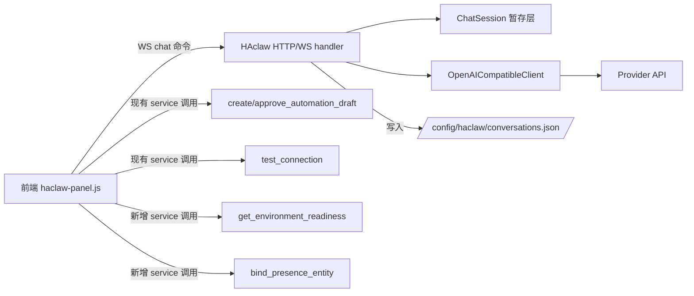

# HAclaw 对话式前端 + Minimal Chat 后端设计 (v1.0)

- **状态**: Draft, 待用户审阅
- **范围**: B(前端 chat 壳 + 最小后端对话通道)
- **后续**: 范围 C(完整 Agent loop / 工具执行 / 审计 / 风险弹窗)见 `2026-05-08-haclaw-agent-loop-tools-design.md`
- **作者**: HAclaw 项目
- **日期**: 2026-05-08

## 1. 背景

当前 `custom_components/haclaw/frontend/haclaw-panel.js` 是一个表单面板,只暴露三个服务的原始入口:`test_connection`、`create_automation_draft`、`approve_automation_draft`,而且要求用户手写自动化触发器和动作的 JSON。这跟 README 里 v1.0 明确写的"Chat 主界面 / 对话式模型切换 / 草稿预览 / 风险确认弹窗"完全不一样。

用户反馈:**当前界面让用户不知道怎么使用**。期望体验是类似 Claude Desktop / Codex Desktop 的对话式应用 — 用自然语言驱动一切。

但目前后端只有 3 个 service,**没有 `haclaw.chat` 这样的对话入口**。所以本 spec 同时设计前端 chat UI 和最小后端对话服务,让"对话驱动"的体验真正闭环。

## 2. 目标和非目标

### 2.1 目标(本 spec 范围 = B)

- 重做面板为对话优先(chat-first)的 UI,布局参考 Claude Desktop Lite 风格
- 引入最小后端对话服务 `haclaw/chat`(WebSocket 命令),按 README JSON 协议解析模型回复
- 在对话流里以 inline 卡片渲染:文字回复 / 候选实体澄清 / 自动化草稿预览 / 风险确认 / `tool_call` 轻提示
- **三种聊天模式**:计划 / 自动化 / 执行 — 模式同时约束 system prompt 和前端可见操作;模式记忆持久化(默认首次为"自动化")
- 首次环境就绪检查器(inline 卡片,3 项必检 + 跳过逻辑)
- 自动化草稿生成时,后端探测缺失集成,在草稿卡片里展示警告
- 用户存在实体绑定向导(inline 卡片,基于已有 HA 实体)
- 设置 modal:模型切换、重新检查环境、重新绑定存在实体
- 移动端响应式:< 640px 顶部状态条折叠

### 2.2 非目标(本 spec 不做,延后到 C 或更后)

- **真正执行模型提议的工具调用**(如 `turn_on_light`):本期 `tool_call` 仅以"灰色一行"显示,不执行;**执行模式 B 阶段也不真执行**,仅以"⚠️ 实验中"标签 + 一次性弹窗说明占位
- **完整 Agent 多轮迭代循环**(`max_iterations` 含 tool→observation→tool→...):本期一次用户消息只触发一次模型调用,模型不能在自己回复内拿工具结果再回复;**注意**:这跟 §18 的"asking-answer 多轮"不冲突 — asking-answer 是跨用户消息的对话,每轮仍是"一来一回"
- **完整安全层 / 服务白名单 / 风险等级计算**:本期 `risk_confirmation` 类型仅在前端渲染卡片,确认按钮先不真正执行(因为没有工具执行层)
- **完整审计日志查询页**:本期审计日志仍由现有 `append_audit_event` 写入,前端不展示
- **流式响应**:本期等模型完整回复后再渲染(JSON 协议下流式收益不大)
- **多会话切换功能**:本期是单一会话 + 历史抽屉(只读列表,可清空整条对话)。完整的多会话 / 重命名 / 编辑留给后续
- **Provider API key 等敏感配置 UI**:本期仍走 HA config flow / options flow,Panel 内只做模型切换和环境检查
- **历史行为模式识别 / 自动化推荐**:扫 recorder.history 找用户行为周期性模式 → 自动推送自动化建议;延后到 follow-up spec

## 3. 安全边界(再次声明)

本 spec 严格遵守 README 既有边界,**任何实现都不允许越界**:

- HAclaw **不安装** HACS / Xiaomi Miot Auto / Mobile App / 任何第三方集成 — 这些都需要写 `.storage/core.config_entries`、运行 shell 或重启 HA,**只检测 + 给链接**
- HAclaw **不收/不存** 原始 MAC、IMEI、手机号、GPS 坐标 — 存在感应只做"绑定哪个已有 person/device_tracker 实体是我"
- 所有错误信息、对话内容、审计日志都必须**脱敏**,不能泄露 API key / token / cookie
- 默认禁用 AI 生成的自动化(`initial_state: false`)
- **凭据永远不进 HAclaw**:用户给第三方集成(如小米账号、HACS GitHub OAuth)的凭据不应该出现在 HAclaw 的输入框、对话历史、配置文件、日志里。HAclaw 通过"安装指令模板"(§19)让用户**复制 prompt → 粘贴到他自己的 AI agent(Claude Code / Codex)** 由 agent 在用户机器上执行;凭据只在用户↔他的 agent 之间流动,HAclaw 全程不接触

## 4. 总体架构



后端新增物:

1. **WebSocket 命令** `haclaw/chat`:接 user_message + conversation_id,返回模型回复(JSON 协议解析后的结构化对象)
2. **WebSocket 命令** `haclaw/conversations/list` / `haclaw/conversations/clear`:历史抽屉用
3. **Service** `haclaw.get_environment_readiness`:返回首次检查清单状态
4. **Service** `haclaw.list_presence_candidates` / `haclaw.bind_presence_entity` / `haclaw.get_presence_binding`:存在实体绑定三件套
5. **Service** `haclaw.switch_model`:仅切换当前 entry options 的 `model` 字段(API key、Base URL 不改);供设置 modal 里的模型下拉用,后端实现等价于 `hass.config_entries.async_update_entry(entry, options={..., CONF_MODEL: new_model})`
6. **现有 `validate_automation_draft` 增强**:返回结果新增 `missing_integrations: [{domain, integration_name, install_link, reason}]` 字段

## 5. 前端布局(方案一 Claude Desktop Lite)

### 5.1 桌面布局 (≥ 640px)

```
┌──────────────────────────────────────────────────────┐
│ HAclaw  · MiMo-V2-Flash · ✅  💡未绑存在  ⚠️1  ⚙ ☰ │ <- 状态条
├──────────────────────────────────────────────────────┤
│                                                      │
│   [空状态:大问候 + 4-6 chip]                       │
│                                                      │
│   或                                                 │
│                                                      │
│   [消息流:用户气泡 / 模型气泡 / 草稿卡 / 候选 chip │
│    卡 / 风险卡 / tool_call 灰行]                     │
│                                                      │
├──────────────────────────────────────────────────────┤
│  [ 输入消息...                              ] 发送 │ <- 始终底部
└──────────────────────────────────────────────────────┘
```

- **状态条左**: `HAclaw · 模型名 · 连通状态`
- **状态条右**(按出现顺序): 弱提示徽章(💡 / ⚠️ 各自有条件)、设置 ⚙、抽屉 ☰
- **抽屉 ☰**: 历史会话列表(本期只读 + "清空当前对话"按钮),从右侧滑入
- **设置 ⚙**: 居中 modal,内容见 §10

### 5.2 移动布局 (< 640px)

- 状态条只保留 `HAclaw · 模型名 · 连通图标` 和 ☰;⚙ 和徽章收进 ☰ 的子菜单
- 输入框和发送按钮等宽贴底
- 卡片宽度 100%,折叠卡默认折叠

### 5.3 空状态

```
        HAclaw,你想让我做什么?

  [打开客厅灯]  [生成晚 7 点开净化器的自动化]
  [当前模型连得通吗]  [认领我的存在实体]
  [检查我的 HA 环境]  [解释一下 automations.yaml 是什么]
```

- 中央对齐,问候字号 28
- chip 圆角药丸,点击 = 立即作为用户消息发送
- 一旦有消息进入对话流,问候和 chip 消失,被消息流替代;新对话(清空)后再次出现

### 5.4 模式选择器

放置在**输入框上方一行**,跟"这条消息要做什么"强相关:

```
├──────────────────────────────────────────────────────┤
│ 模式: [📋 计划] [⚡ 自动化] [🛠 执行 ⚠️实验]         │  <- 5.4
├──────────────────────────────────────────────────────┤
│  [ 输入消息...                              ] 发送 │
└──────────────────────────────────────────────────────┘
```

#### 5.4.1 三种模式

| 模式 | 含义 | 模型 prompt 约束 | 前端可见操作 |
|------|------|-----------------|-------------|
| 📋 **计划** | 只 chat,不就行操作 — 用来想清楚需求 | system prompt 末尾追加"当前模式:计划。只允许返回 `final_response` 或 `clarification`。即使用户要求生成自动化,也要返回 `final_response` 描述你建议的自动化思路,但**不要**返回 `automation_draft`" | 即使模型违规返回了 `automation_draft`,卡片也以**只读**展示且**审批按钮全禁用**(置灰),并附"切到自动化模式后才能审批写入"提示 |
| ⚡ **自动化** | 设计自动化(默认模式) | system prompt 末尾追加"当前模式:自动化。鼓励返回 `automation_draft` 推进用户想做的自动化;允许 `clarification` 和 `final_response`;**不要返回 `tool_call`**(本期没工具执行)" | `automation_draft` 卡片审批按钮启用,走现有 `approve_automation_draft` 服务 |
| 🛠 **执行** | 控制设备 — **B 阶段为实验占位** | system prompt 末尾追加"当前模式:执行。允许返回 `tool_call` 提议设备控制;允许其他全部协议类型" | 输入框旁红色 `⚠️ 实验中` 标签;模式切换瞬间弹一次性 dialog "工具执行层 v1.x 启用,本模式现在仅展示模型会怎么提议工具调用,不会真正控制设备";`tool_call` 灰行渲染保持(同非执行模式),不真路由到任何 service |

#### 5.4.2 切换行为

- 切换瞬间:更新前端状态 + 写 `ui_state.json` 的 `last_mode`(schema 详见 §11.4)
- 切换不清空当前对话(模型上下文里包含历史,模式切换只影响**下一次** prompt 拼接)
- 切到执行模式且 `ui_state.json` 中 `execute_mode_warning_seen` 为 `false` → 弹一次性确认 dialog,确认后写 `execute_mode_warning_seen: true`
- 切换不创建新会话 — 整个 panel 沿用单会话设计(参见 §2.2 非目标里的"多会话切换功能")

#### 5.4.3 默认值规则

- 优先读 `ui_state.json` 的 `last_mode`
- 如不存在或非合法值(`plan` / `automation` / `execute` 之一),默认 `automation`
- 这是为了让 v1.0 用户首次打开就能体会到 HAclaw 的核心价值(自动化生成)

#### 5.4.4 模式 vs 模式选择器的关系

- 模式是状态 + 行为约束;选择器只是 UI 触发器
- 切换前端 chip 即等同于改变下一次 `haclaw/chat` 调用时附带的 `mode` 字段(详见 §7.1)
- 模式状态对前端组件渲染**也**有影响,详见 §6.1

## 6. 消息组件清单

### 6.1 按模式的渲染/交互差异

模式不影响消息**是否渲染**(任何类型都按 JSON `type` 渲染),但影响**交互按钮**:

| 模式 | `automation_draft` 卡片审批按钮 | `risk_confirmation` 卡片确认按钮 | `tool_call` 灰行 |
|------|-------------------------------|--------------------------------|----------------|
| 计划 | **禁用**,提示"切到自动化模式后才能审批写入" | 禁用 + B 阶段统一提示 | 渲染但加注"计划模式下模型不应返回此类型,这是异常输出" |
| 自动化 | **启用**,走 `approve_automation_draft` | 禁用 + "工具执行层未上线" | 渲染但加注"自动化模式下不应出现 tool_call,异常输出" |
| 执行 | 启用 | 禁用 + "工具执行层未上线"(B 阶段执行模式仍不真执行) | 正常灰行渲染,无异常注 |

> 即使后端协议过滤(§7.5)已经按模式拒绝越界类型,前端仍要做兜底渲染处理 — 防御式 UI,模型偶尔违规时不至于白屏。

### 6.2 消息组件总表

每种类型一个独立组件,按 JSON `type` 字段分发渲染:

| JSON type | 组件 | 关键交互 |
|-----------|------|---------|
| `final_response` | 文字气泡 | 纯展示;支持基础 markdown(粗体/列表/代码块) |
| `clarification` | 候选 chip 卡(**chip 优先,但文字输入是一等公民可见 fallback**) | schema 见 §7.6;每个 candidate 渲染为大 chip(`label` 为主文,可选 `subtitle` 灰字次行);点击 = 把 `label` 作为下一条用户消息发送(明文,模型读得懂);**当 `allow_free_text=true` 时,chips 下方出现一个真正的输入框 + 发送按钮**(不是 hint),placeholder 文案描述期望的输入(如"或者输入更具体的条件,例如:除节假日外都开");用户既可点 chip 也可在输入框打字 |
| `automation_draft` | 草稿折叠卡 | 默认折叠仅显示标题 + 风险标签;展开看 YAML + **设计依据 `rationale` 区**(从对话推演的实体/触发/条件/动作);按钮组取决于 `requires_confirmation`:为 `true` 时显示 `[审批并确认风险]`(调用 `approve_automation_draft` 并传 `confirmed: true`),为 `false` 时显示 `[审批写入]`;另有 `[丢弃]` 和 `[修改后再说]`(把草稿 YAML 复制到输入框);如果 `missing_integrations` 非空,警告区每个缺失项额外加一个 `[📋 安装指令]` 按钮(调出安装指令 modal,详见 §19),`审批*` 按钮禁用直到忽略警告或重新检查通过 |
| `risk_confirmation` | 风险卡(红边框) | 高对比红色背景,显示风险描述 + 计划动作;按钮 `[确认执行]`(本期禁用 + 提示"工具执行层未上线,留作展示")`[取消]` |
| `tool_call`(模型尝试调工具) | 灰色单行 | `↪ 模型尝试调用 get_entity_state(本阶段不执行)`,折叠不展开 |
| (前端注入)`environment_check` | 环境就绪卡(可折叠) | §8 详述 |
| (前端注入)`presence_bind` | 存在实体绑定卡 | §9 详述 |
| (前端注入)`thinking` | 灰色 spinner 行 | "思考中... · 已用 1.2s" |
| (前端注入)`error` | 黄色错误卡 | 显示脱敏后中文错误,按钮 `[重试]` |

## 7. 后端对话通道 `haclaw/chat`

### 7.1 WebSocket 命令格式

发送:

```json
{
  "id": 42,
  "type": "haclaw/chat",
  "conversation_id": "conv_2026_05_08_abc",
  "user_message": "打开客厅灯",
  "mode": "automation"
}
```

`mode` 必须是 `plan` / `automation` / `execute` 之一;非法值后端拒绝并返回错误。

返回(单次响应,本期非流式):

```json
{
  "id": 42,
  "type": "result",
  "success": true,
  "result": {
    "conversation_id": "conv_2026_05_08_abc",
    "assistant_message": {
      "type": "final_response",
      "message": "已识别到 light.living_room,但本期工具执行层未上线,所以我不能直接打开。你可以暂时在 HA 设备页面手动开,或者等下一个版本。"
    },
    "usage": {"prompt_tokens": 480, "completion_tokens": 35},
    "model": "mimo-v2-flash"
  }
}
```

错误返回保留 HA WS 标准格式,`error.code` 中文 message 已脱敏。

### 7.2 处理流程

1. 校验入参(`conversation_id` 格式合法、`user_message` 非空、长度上限 4000)
2. 从 `/config/haclaw/conversations.json` 读取该 conversation 历史(若存在)
3. 拼接 system prompt(中文优先,见 §7.3) + 历史 + 当前用户消息
4. 调 `OpenAICompatibleClient.chat_with_usage`,`temperature` 用 entry 配置,`max_tokens` 默认 1024
5. **JSON 协议校验**:必须是合法 JSON,且 `type` ∈ 协议白名单(`final_response`/`clarification`/`automation_draft`/`risk_confirmation`/`tool_call`)。失败时:
   - 重试一次:**新增一条 system message**(不污染用户消息)放在历史末尾、调用前,内容固定为 `"上一次模型输出不是合法 JSON 或不在协议类型白名单内,请只返回符合 HAclaw JSON 协议的对象,不要任何额外文字。"`
   - 仍失败 → 不写入 conversations.json 的 assistant 部分(用户消息已经写入,保留),返回前端注入的 `error` 消息;审计日志写入 `result: "protocol_error"`
6. 写历史(用户消息 + 模型回复)回 `conversations.json`,触发滚动淘汰(>50 条会话)
7. 写审计日志(`append_audit_event`),包含 user_input、provider、model、result type;**不写完整模型回复内容**(脱敏)
8. 返回结构化结果给前端

### 7.3 System Prompt(中文优先骨架)

分为**基础 prompt**(所有模式共享)和**模式 prompt 后缀**(按 `mode` 字段拼接)。基础 prompt 放在 `agent/prompts.py` 的 `BASE_SYSTEM_PROMPT`;模式后缀放在 `MODE_SUFFIX_PLAN` / `MODE_SUFFIX_AUTOMATION` / `MODE_SUFFIX_EXECUTE`。最终发给模型的 system 消息 = `BASE_SYSTEM_PROMPT + "\n\n" + MODE_SUFFIX_<mode>`。

#### 7.3.1 基础 prompt

```
你是 HAclaw,Home Assistant 的中文 AI 助手。
严格遵守:
- 只输出合法 JSON,不要在 JSON 外混入 Markdown 或解释文字
- 协议类型白名单(具体允许哪些由当前模式决定): final_response / clarification / automation_draft / risk_confirmation / tool_call
- 用中文回复
- 不要编造实体 ID
- 高风险操作(开锁、撤防、重启 HA、shell)必须用 risk_confirmation 类型
- 不要请求用户提供 API key、token、密码、MAC、GPS 坐标

当前已知用户上下文:
- 绑定的存在实体: {{me_person_entity_id 或 "未绑定"}}
- 当前模型: {{model_name}}

特殊指令:
- 如果"绑定的存在实体"为"未绑定",并且用户的请求涉及到家/离家/在家时/不在家时类自动化,请返回 final_response 类型,且 message 字段必须包含字符串 "[BIND_PRESENCE]"(放在中文说明的开头);前端会据此插入绑定向导卡片。其他场景下严禁使用此 marker。
```

#### 7.3.2 模式后缀

```
# MODE_SUFFIX_PLAN
当前模式:📋 计划模式。
- 你**只能**返回 final_response 或 clarification 两种类型
- 即使用户要求"生成自动化",也只用 final_response 描述你建议的自动化思路、可能的实体、可能的 trigger,不要返回 automation_draft
- 即使用户要求"打开/关闭设备",也只用 final_response 描述你的理解和建议步骤,不要返回 tool_call
- 这是用户用来想清楚需求的模式,不要执行任何动作
```

```
# MODE_SUFFIX_AUTOMATION
当前模式:⚡ 自动化模式。

【核心原则:先问清楚,再生成】
你的目标是生成对用户**真正实用**的自动化,不是匆忙生成一份模糊草稿。
不要直接返回 automation_draft,除非以下维度都已经从对话里明确(包括用户本轮输入和之前轮次的回答):

  1. 实体: 哪个 entity_id(必须真实存在于 hass.states,不要编造)
  2. 触发: 类型(time / state / numeric_state / 存在感应 / 设备事件)+ 精确参数(具体小时/分钟、状态值、数值阈值)
  3. 条件: 是否需要附加 condition(只在工作日?只在用户在家时?只在天黑后?— 用户没说默认就是没有,不要自作主张加上)
  4. 动作参数: 灯亮度、空调温度、扫地机房间等(用户没说就用 HA 默认)
  5. 边缘情况: 设备离线?多次触发要不要去重?— 这一项可在 rationale 里说"未问及,默认 X"

【提问规则:chip 优先,但开放问题要允许文字输入】
- 缺信息时优先用 clarification 类型问,**不用 final_response 抛开放问题让用户打字**(开放问题用 clarification 的 allow_free_text=true 覆盖)
- clarification 的 candidates 必须 2–6 项,涵盖最常见的几种回答
- 一次只问一个最关键的维度(单 clarification 一个 message),不要把多个问题挤进一个 message
- 用户答了一轮 → 下一轮继续问下一个维度,直到所有关键维度明确
- **最多 4 轮 clarification**,4 轮后即使有些维度仍模糊,也用合理默认值生成 draft + 在 rationale 里标注"假设了 X(用户未明确)"

【何时设 allow_free_text=true】
默认 false。但**以下场景必须设 true**(同时配 free_text_placeholder 给一句具体范例):
- 时间相关(用户可能要"19:30"而不是整点 chip)
- 日期/节假日相关(中国节假日不能简单二分,例如:用户可能要"除春节和国庆外")
- 数值阈值(温度、亮度、湿度等)
- 自动化命名 / 设备别名
- 用户在之前轮次已经给出非 preset 答案的情况(说明 preset 不够覆盖)

【关于节假日 / 工作日的特殊处理】
- HA 自带 `workday` 集成,支持中国大陆 / 香港 / 台湾等地区的节假日识别
- 当用户提到"节假日 / 假日 / 法定假 / 春节 / 国庆"等关键词,你应当:
  1. 检查 `hass.config_entries` 是否已有 `workday` config_entry
  2. 已有 → 直接在生成的 condition 里引用 `binary_sensor.workday` 实体
  3. 没有 → 用 clarification 询问用户"中国节假日识别需要 HA workday 集成,要不要加?",candidates 给 [是,加上] [先用工作日近似] [我自己后面装];allow_free_text=true 让用户问"什么是 workday"
- workday 是 HA 内置(不算第三方),不需要走"安装指令"模板路径;它只需要用户在 HA UI 配置一个 config_entry

【生成 draft 之前的最后一步】
信息够了时,先返回 final_response 给一句简明摘要(< 60 字),
让用户校对一遍:"我理解你想要 X 实体在 Y 触发时执行 Z 动作 — 我开始生成草稿了"。
如果用户回"嗯"/"是"/"对"/"OK"/"好的"/"行"/"可以"/"开始吧"/"go"等正面词,下一轮再返回 automation_draft。
如果用户提出修正,继续 clarification 或 final_response 调整。

【automation_draft 必须包含 rationale 字段】
不要省略 rationale。每个字段记录"这条设计依据来自用户哪一轮的回答":
- entities: 用户在哪一轮选了哪个候选
- trigger: 用户怎么描述触发,你怎么映射到 HA trigger 类型
- conditions: 用户明确要求或不要求 condition
- actions: 用户明确指定或采用默认
- edge_cases: 已问 / 未问 / 默认假设的细节

【绝不要做的事】
- 不要直接生成包含编造实体 ID 的草稿(任何不在 hass.states 的 entity_id 都不行)
- 不要假设默认值不告知用户(比如默认全天 vs 仅工作日 — 必须问或在 rationale 标注)
- 不要一次问 5 个以上问题,会劝退
- 不要返回 tool_call(本期没工具执行能力)
```

```
# MODE_SUFFIX_EXECUTE
当前模式:🛠 执行模式(实验中)。
- 允许返回 tool_call 提议设备控制 — 但用户已经被告知工具执行层 v1.x 才上线,本期 tool_call 只展示不执行
- 高风险操作(开锁、撤防、重启 HA、shell_command.*、xiaomi_miot.get_token)依然必须用 risk_confirmation 类型
- 允许其他全部协议类型
- tool_call 的 args 字段要给出完整、可执行的实体 ID 和参数,即使本期不执行
```

详细 prompt 调优(尤其小米生态识别、`tool_call` 工具列表)留给 C 范围。

### 7.4 上下文长度控制

- 历史消息进 prompt 时,从最新往前累加,达到 `max_history_chars = 8000` 即截断,超出部分丢弃
- 不做 token 精确计算,字数估算够用;真正的 token 限流由 provider 报错回流

### 7.5 按模式的后端协议过滤

**模型即使违反 prompt 指令返回了越界类型,后端也要拦截**(防御深度):

```python
ALLOWED_TYPES_BY_MODE = {
    "plan": {"final_response", "clarification"},
    "automation": {"final_response", "clarification", "automation_draft"},
    "execute": {"final_response", "clarification", "automation_draft",
                "risk_confirmation", "tool_call"},
}
```

处理:

- 若 `assistant_message["type"]` 不在当前模式允许集合中 → 视同协议失败,走 §7.2 步骤 5 的 system message 重试一次
- 重试仍越界 → 返回 `error` 给前端,审计日志写 `result: "mode_violation"`,**不写入 conversations.json 的 assistant 部分**
- 这样保证模式约束既来自 prompt(模型可读),也来自代码(模型不可绕过)

### 7.6 `clarification` 类型 schema(扩展为通用 multiple choice)

**schema**:

```json
{
  "type": "clarification",
  "message": "周末和节假日要怎么处理?",
  "candidates": [
    {"id": "everyday", "label": "每天都开"},
    {"id": "weekday", "label": "只工作日"},
    {"id": "weekday_no_holiday", "label": "工作日且非节假日",
     "subtitle": "依赖 HA workday 集成"}
  ],
  "allow_free_text": true,
  "free_text_placeholder": "或者输入更具体的条件,例如:除春节和国庆外都开"
}
```

字段约束:

- `message`:必填,中文问句,≤ 80 字
- `candidates`:必填,长度 2–6;**少于 2 项时后端拒绝**(单选项无意义,模型应该用 final_response 代替)
- `candidates[].id`:必填,字符串,作为机器可识别 ID(实体场景=entity_id;通用场景=自定义短串如 `weekday`)
- `candidates[].label`:必填,中文短句,≤ 30 字,作为用户看到 + 点击后回传的文本
- `candidates[].subtitle`:可选,灰字次行(实体场景常用 `entity_id · state`;通用场景可放"依赖 X 集成"等 hint)
- `allow_free_text`:可选,默认 `false`
- `free_text_placeholder`:仅 `allow_free_text=true` 时使用,作为输入框 placeholder 文案,引导用户输入有用的具体内容;模型应该尽量给一个能让用户照葫芦画瓢的范例

**`allow_free_text` 设置原则**(给模型 prompt 用):

- 默认 `false`(图形化选择优先)
- 但**当问题包含长尾可能性时,必须设 `true`**,典型场景:
  - 时间(用户可能想"19:30"而不是 chip 里的整点)
  - 日期/节假日(中国节假日不能被简单的"工作日/周末"二分)
  - 自定义名称(自动化命名、设备别名)
  - 数值阈值(温度、亮度等)
  - 任何用户已经在历史里给出非 preset 答案的情况
- chip 仍提供 3-4 个最常见预设,**输入框是真正的扩展位**而不是装饰

向后兼容:旧形态 `{candidates: [{entity_id, name}]}` 在 `chat_session.py` 接收解析时做迁移,自动补成新形态(`id ← entity_id`,`label ← name`,`subtitle ← entity_id`)。

**前端 chip + 输入框渲染规则**:

- chip 横排或网格,**最小可点面积 44×44px**(满足 Apple HIG / WCAG 触屏指引,确保手机/平板墙板可点)
- chip 字号 ≥ 14px,有明显边框/背景色,不要做成单色文字链接
- `subtitle` 用 11–12px 灰字置于 `label` 下方(可选)
- **`allow_free_text=true` 时,chips 下方出现一个真正可见的输入框**(不是 hint!):
  - 输入框宽度 100%,高度 ≥ 40px,边框明显
  - placeholder 用 `free_text_placeholder` 字段(如"或者输入更具体的条件,例如:除春节和国庆外都开")
  - 输入框右侧有 `[发送]` 按钮(或 Enter 即发送)
  - 输入框上方一行小灰字 "或者自定义:" 作为视觉分隔
- `allow_free_text=false` 时,**完全不显示**输入框区域(避免干扰)
- 用户点 chip 后:输入框被 chip 的 label 自动填入并立即发送,不要求二次确认(降低操作成本)
- 用户在输入框打字后按发送:文字直接作为下一条用户消息

### 7.7 `automation_draft` 的 `rationale` 字段(必填)

**schema 扩展**:

```json
{
  "type": "automation_draft",
  "title": "晚上 7 点开客厅净化器",
  "description": "...",
  "automation": { "alias": "...", "trigger": [...], "action": [...] },
  "risk_level": "low",
  "requires_confirmation": false,
  "rationale": {
    "entities": ["fan.mi_air_purifier_living(你刚选的'客厅净化器')"],
    "trigger": "每天 19:00(你确认了'周末也开')",
    "conditions": [],
    "actions": ["fan.turn_on,默认 mode"],
    "edge_cases": "未问及离线情况,默认 HA 触发即尝试"
  }
}
```

每个字段都是中文短句,**对应模型在生成前已经从对话里推演到的依据**。

校验规则:

- `rationale` **必填**;若模型未返回:走 §7.2 步骤 5 system message 重试一次,内容为 `"automation_draft 必须包含 rationale 字段说明设计依据,请补全"`
- 重试仍缺失 → **不视为协议失败**,但在前端卡片渲染时显示一条警告 `⚠️ 模型未提供设计依据,无法审计这个草稿是怎么推演出来的;建议丢弃后再试一次`,审批按钮**禁用**,审计日志记 `result: "rationale_missing"`
- 这样既不让模型偷懒,也不会用户用不了

**前端 rationale 区渲染**(`automation_draft` 卡片展开后):

```
设计依据(从对话推演)
─────────────────────
实体:fan.mi_air_purifier_living(你刚选的"客厅净化器")
触发:每天 19:00(你确认了"周末也开")
条件:无
动作:fan.turn_on,默认 mode
边缘情况:未问及离线情况,默认 HA 触发即尝试
─────────────────────
```

让用户能审计这份草稿是怎么从对话推出来的,本身也是一道"避免模糊草稿"的关。

## 8. 首次环境就绪检查

### 8.1 必检项(只 3 个)

| 检测项 | 后端实现 | 缺失文案 | 给的链接 |
|--------|---------|---------|---------|
| Provider 连通 | 复用 `_async_handle_test_connection` | "Provider 还没接通,先去配置页接通" | `/config/integrations/integration/haclaw`(HA 集成详情页) |
| 蓝牙/WiFi 存在感应(任意 device_tracker.* 存在) | `len([s for s in hass.states.async_all() if s.entity_id.startswith("device_tracker.")])` > 0 | "找不到任何 device_tracker 实体,'我到家'类自动化做不了" | `https://companion.home-assistant.io/`(HA Companion App)和 `https://www.home-assistant.io/integrations/bluetooth_le_tracker/`(蓝牙追踪) |
| Xiaomi Home (`xiaomi_miot` config_entry 存在) | `hass.config_entries.async_entries("xiaomi_miot")` 非空 | "没装 Xiaomi Miot Auto,小米生态识别会受限" | `https://github.com/al-one/hass-xiaomi-miot`(Xiaomi Miot Auto GitHub,README 含 HACS 安装说明) |

### 8.2 不在首屏的项(收进设置 modal 的"高级"区)

- HACS(门槛高,作为可选)
- Xiaomi Miio (老协议,跟 Miot 重叠)
- Aqara / Yeelight / Roborock / Dreame(用户按需装)

### 8.3 跳过行为

- 用户点"全部跳过" → 写入 `/config/haclaw/ui_state.json`:`{"env_check_dismissed": true}`
- 之后 `env_check` 卡片不再首次自动弹
- 但状态条出现 ⚠️ 小红点,数字 = 仍未通过的项数;点击 = 立即重新拉环境检查并展示卡片
- 全绿后小红点消失;`env_check_dismissed` 标记保留(用户已知情)

### 8.4 后端 service 设计

新增 `haclaw.get_environment_readiness`:

```yaml
get_environment_readiness:
  name: Get environment readiness
  description: Detect HACS / Xiaomi / mobile_app / device_tracker readiness for HAclaw onboarding.
  fields: {}
```

返回(`hint` 和 `links` 文案随实现稳定化,但 schema 固定):

```json
{
  "items": [
    {"id": "provider", "ok": true, "label": "Provider 连通", "hint": null,
     "links": [], "install_prompt": null},
    {
      "id": "device_tracker",
      "ok": false,
      "label": "蓝牙/WiFi 存在感应",
      "hint": "找不到任何 device_tracker 实体,'我到家'类自动化做不了",
      "links": [
        {"text": "Companion App", "url": "https://companion.home-assistant.io/"},
        {"text": "蓝牙追踪", "url": "https://www.home-assistant.io/integrations/bluetooth_le_tracker/"}
      ],
      "install_prompt": null
    },
    {
      "id": "xiaomi_miot",
      "ok": false,
      "label": "Xiaomi Home",
      "hint": "没装 Xiaomi Miot Auto,小米生态识别会受限",
      "links": [
        {"text": "Xiaomi Miot Auto", "url": "https://github.com/al-one/hass-xiaomi-miot"}
      ],
      "install_prompt": {
        "title": "安装 Xiaomi Miot Auto",
        "body": "<完整模板字符串,HAclaw 已知字段已替换,占位符保留 {{TODO_USER:...}}>",
        "todo_user_fields": ["XIAOMI_EMAIL", "XIAOMI_PASSWORD"]
      }
    }
  ],
  "advanced": [
    {
      "id": "hacs",
      "ok": false,
      "label": "HACS",
      "hint": "门槛较高,通常通过 shell 命令安装;装好 HACS 后再通过 HACS 装小米/第三方集成",
      "links": [{"text": "HACS 官方", "url": "https://hacs.xyz/"}],
      "install_prompt": {
        "title": "安装 HACS",
        "body": "<完整模板字符串>",
        "todo_user_fields": []
      }
    }
  ],
  "dismissed": false,
  "failing_required_count": 2
}
```

`failing_required_count` 给前端用来直接渲染状态条 `⚠️N` 徽章,不必前端再数一遍。`install_prompt` 字段为 `null` 表示该项无需安装(如已通过的 provider)或没有定义模板(如 device_tracker — 它需要装 mobile app/路由器集成,装哪种取决于用户偏好,模板太分散就先不做)。

### 8.5 `install_prompt` 模板填充流程

1. `tools/environment.py` 维护 `INSTALL_PROMPT_TEMPLATES: dict[str, str]`,key 是 `domain`(如 `xiaomi_miot`、`hacs`),value 是带占位符的模板字符串
2. `get_environment_readiness` 在返回每个未通过的 item 前,调用 `render_install_prompt(domain)`:
   - 替换 `{{HA_KNOWN: HA_CONFIG_DIR}}` → `hass.config.path()` 的实际路径
   - 替换 `{{HA_KNOWN: HA_INSTALL_TYPE}}` → 从 `hass.config.config_source` 推断("Core" / "Container" / "Supervised" / "OS")
   - **保留** `{{TODO_USER: <FIELD>}}` 不替换(由用户在他自己的 AI agent 那边填)
   - **保留** `{{TODO_AGENT: <说明>}}` 不替换(给接收 agent 看的指引)
3. 解析出所有 `{{TODO_USER: <FIELD>}}` 占位符,作为 `todo_user_fields` 列表返回(前端展示时高亮提示)
4. 完整设计见 §19

## 9. 存在实体绑定

### 9.1 触发路径(B 阶段两条)

**路径 A:用户主动**
1. 用户点空状态 chip "认领我的存在实体",或在设置 modal 里点"重新绑定"
2. 前端**直接(不调模型)**通过 `haclaw.list_presence_candidates` 拉候选实体
3. 在对话流里以前端注入方式追加一条 `presence_bind` 消息
4. 用户从卡片里点选一个 → 调 `haclaw.bind_presence_entity` → 卡片变 ✅

**路径 B:模型在对话里识别到需要绑定**
1. 用户说"我到家就开客厅灯"
2. system prompt(§7.3)里有指令:**如果 `me_person_entity_id` 为"未绑定"且用户意图涉及到家/离家/在家时,模型必须返回 `final_response` 类型,文案大致为"你还没绑定存在实体,请先点下方的'认领我的存在实体' chip"** — B 阶段不让模型直接返回 `presence_bind` 类型(避免过度扩展协议)
3. 前端检测 `final_response` 中包含 marker 字符串 `[BIND_PRESENCE]` 时,自动追加一条 `presence_bind` 消息(marker 由 system prompt 教模型携带)

> 决策记录:为何用 marker 而非新增协议类型?B 阶段尽量不扩 README 协议,marker 是最小侵入方案;C 阶段如果常用,再考虑提升为协议类型 `presence_bind_request`。

### 9.2 卡片内容

- 列出所有 `person.*`(排在前)和 `device_tracker.*`,显示 `friendly_name` + 当前 state(如 home / not_home / unknown)
- 一行一项,可点击;选中后高亮,然后用户按"确认绑定"按钮提交
- 顶部一行说明:"HAclaw 只存这个 entity_id,不会读取你的 MAC、手机号或 GPS 坐标"

### 9.3 后端 service

```yaml
list_presence_candidates:
  name: List presence candidates
  description: Return person.* and device_tracker.* entities with friendly_name and state, for the binding card.
  fields: {}

get_presence_binding:
  name: Get presence binding
  description: Return the currently bound presence entity_id, or null.
  fields: {}

bind_presence_entity:
  name: Bind presence entity
  description: Persist the user-selected presence entity_id to /config/haclaw/presence.json.
  fields:
    entity_id:
      required: true
      selector: { text: }
```

`bind_presence_entity` 处理:
- 校验 `entity_id` 必须以 `person.` 或 `device_tracker.` 开头
- 校验该实体在 `hass.states` 中存在
- 写 `/config/haclaw/presence.json`:`{"me_person_entity_id": "<entity_id>", "bound_at": "<iso8601>"}`
- 写审计日志事件 `presence_bound`(只记 entity_id,不记任何 MAC/坐标)
- 任何校验失败 → 返回 `{"success": false, "message": "<中文>"}`,不写

### 9.4 不存:

- MAC、IMEI、手机号、GPS 原始坐标、SSID 全部不存
- 只存被绑定的 `entity_id` 字符串和绑定时间戳

## 10. 设置 Modal

居中浮层,关闭按钮 X。内容分区:

```
┌─────────────────────────────────────┐
│ 设置                              ✕ │
├─────────────────────────────────────┤
│ Provider                            │
│   当前: Xiaomi MiMo                 │
│   模型: mimo-v2-flash    [切换 ▾] │
│   API Key: ✱✱✱✱✱✱✱✱✱✱✱2a3f       │
│   [去 HA 修改高级配置 →]           │
├─────────────────────────────────────┤
│ 环境                                │
│   [重新检查环境]                    │
│   高级:HACS / Xiaomi Miio / 其他   │
├─────────────────────────────────────┤
│ 存在感应                            │
│   当前: person.jiajia               │
│   [重新绑定]                        │
├─────────────────────────────────────┤
│ 对话                                │
│   [清空当前对话]  [清空全部历史]   │
└─────────────────────────────────────┘
```

- 模型切换:下拉来自 `PROVIDER_PRESETS[provider_preset]["models"]`(已在 `const.py` 内置)+ entry 当前 `model`(若未在预设中,作为"自定义"项保留);用户选完后调 `haclaw.switch_model({ model: <new> })`;后端只更新 entry 的 `options[CONF_MODEL]`,**API key、Base URL、preset 都不改**
- 切模型成功后,顶部状态条立即更新(订阅 entry update 事件 → 重新读 entry options 即可)
- "去 HA 修改高级配置 →"链接到 `/config/integrations/integration/haclaw`,由 HA 自带 options flow 处理 API key、Base URL、temperature 等

## 11. 对话存储

### 11.1 文件

`/config/haclaw/conversations.json`:

```json
{
  "conversations": [
    {
      "id": "conv_2026_05_08_abc",
      "created_at": "2026-05-08T14:00:00+08:00",
      "updated_at": "2026-05-08T14:05:30+08:00",
      "messages": [
        {"role": "user", "content": "打开客厅灯", "ts": "..."},
        {"role": "assistant", "type": "final_response", "content": {...}, "ts": "..."}
      ]
    }
  ]
}
```

### 11.2 容量管理

- 最多 50 条会话,FIFO 滚动淘汰
- 单会话最多 200 条消息,超出在新一次写入时截断最旧的(保留最近 200)
- 文件大小 > 5MB 时强制清理最旧 25%

### 11.3 清空

- "清空当前对话" → 清空当前 conversation_id 的 messages 数组
- "清空全部历史" → conversations 数组置 `[]`
- 不删 audit log(审计独立保留)

### 11.4 UI 状态文件 `ui_state.json`

`/config/haclaw/ui_state.json`:

```json
{
  "env_check_dismissed": false,
  "execute_mode_warning_seen": false,
  "last_mode": "automation",
  "last_conversation_id": "conv_2026_05_08_abc"
}
```

读写规则:

- `env_check_dismissed`:用户在环境就绪卡里点"全部跳过"后置 `true`(§8.3)
- `execute_mode_warning_seen`:用户首次切到执行模式并确认 dialog 后置 `true`(§5.4.2)
- `last_mode`:每次模式切换写入,值必须是 `plan` / `automation` / `execute` 之一;非法值或缺失时前端默认为 `automation`(§5.4.3)
- `last_conversation_id`:打开 panel 时优先用这个 id 续聊,不存在则新建
- 文件读写都通过 `storage/ui_state.py` 集中处理,不允许各组件直接 read/write

## 12. 自动化草稿增强:`missing_integrations`

`tools/automation.py` 的 `validate_automation_draft` 函数返回结构新增字段:

```python
@dataclass
class ValidationResult:
    valid: bool
    automation: dict
    errors: list[str]
    warnings: list[str]
    risk_level: str
    requires_confirmation: bool
    missing_integrations: list[dict]  # 新增
```

每个元素:

```python
{
    "domain": "xiaomi_miot",
    "service": "xiaomi_miot.set_something",
    "integration_name": "Xiaomi Miot Auto",
    "install_link": "https://github.com/al-one/hass-xiaomi-miot",
    "install_prompt": {
        "title": "安装 Xiaomi Miot Auto",
        "body": "<完整模板字符串>",
        "todo_user_fields": ["XIAOMI_EMAIL", "XIAOMI_PASSWORD"]
    },
    "reason": "草稿用到了 xiaomi_miot 服务但未检测到这个集成"
}
```

`integration_name`、`install_link` 和 `install_prompt` 都来自 `tools/environment.py` 里维护的常量映射(domain → 中文名 + 链接 + 模板),与 §8 首次环境检查共用同一份;无映射的 domain `integration_name` 退化为 domain 字符串、`install_link` 为 `null`、`install_prompt` 为 `null`。

实现:扫草稿里所有 `action[*].service`,对每个 service 取 domain,在已知集成 → 缺失列表里查;`hass.services.has_service(domain, service)` 失败的全部记录。

前端在草稿卡片底部多渲染一个黄色警告区:

```
⚠️ 这个草稿用到 xiaomi_miot 服务,但你还没装这个集成
   [安装 Xiaomi Miot Auto](link)
   [仍然审批](禁用,直到装好或忽略警告)
```

## 13. 文件改动概览(实现层信号,不是最终列表)

新增:

- `custom_components/haclaw/agent/__init__.py`(包标识)
- `custom_components/haclaw/agent/prompts.py` — `BASE_SYSTEM_PROMPT` + `MODE_SUFFIX_*`(三种模式后缀,见 §7.3) + BIND_PRESENCE marker 指令
- `custom_components/haclaw/agent/protocol.py` — JSON 响应解析 + 协议白名单校验 + **按模式过滤 `ALLOWED_TYPES_BY_MODE`**(见 §7.5) + clarification schema 迁移(旧 `{entity_id, name}` → 新 `{id, label, subtitle}`,见 §7.6) + automation_draft `rationale` 必填校验(见 §7.7)
- `custom_components/haclaw/agent/chat_session.py` — 单轮对话编排,接现有 `OpenAICompatibleClient`,负责按 mode 拼接 prompt 后缀
- `custom_components/haclaw/storage/conversations.py` — `conversations.json` 读写 + 滚动淘汰
- `custom_components/haclaw/storage/presence.py` — `presence.json` 读写 + entity_id 校验
- `custom_components/haclaw/storage/ui_state.py` — `ui_state.json`(env_check_dismissed 等)
- `custom_components/haclaw/tools/environment.py` — 三项环境检测 + domain → integration_name/link 映射常量 + `INSTALL_PROMPT_TEMPLATES`(§19)+ `render_install_prompt(domain, hass)` 函数(替换 HA_KNOWN 占位符,保留 TODO_USER / TODO_AGENT)
- `tests/test_protocol.py` — 5 种协议类型 + 非法 JSON + `ALLOWED_TYPES_BY_MODE` 三种模式各自的拒绝集合
- `tests/test_chat_session.py` — 正常对话、协议失败重试、上下文截断、模式后缀拼接断言
- `tests/test_environment.py` — 三项检测的 ok/缺失分支 + `render_install_prompt` 测试(HA_KNOWN 替换、TODO_USER 保留、未知 domain 返回 null)
- `tests/test_presence.py` — list/get/bind 三服务,含错误 entity_id 拒绝
- `tests/test_conversations_storage.py` — 滚动淘汰、单会话上限、超大文件清理
- `tests/test_ui_state.py` — `ui_state.json` 读写、`last_mode` 非法值容错、`execute_mode_warning_seen` 持久化

修改:

- `custom_components/haclaw/__init__.py` — 注册 `haclaw/chat` WS 命令、注册 5 个新 service(env、presence×3、switch_model)
- `custom_components/haclaw/services.yaml` — 5 个新 service 声明
- `custom_components/haclaw/const.py` — 加 `STORAGE_*` 文件名常量(`conversations.json`、`presence.json`、`ui_state.json`)、模型切换 service 名等
- `custom_components/haclaw/tools/automation.py` — 加 `missing_integrations`,复用 `tools/environment.py` 的映射常量
- `tests/test_automation.py` — 增加 `missing_integrations` 案例
- `tests/test_integration_services.py` — 增加新 service 的注册/调用断言
- `custom_components/haclaw/frontend/haclaw-panel.js` — **整体重写**为对话式 UI;单文件 web component(预计 700-1000 行,如超过 1200 行考虑拆 ES 模块)

## 14. 接受标准(Acceptance Criteria)

### 14.1 前端可见

- [ ] 打开 HAclaw 面板,看到顶部状态条 + 中央问候 + 6 个建议 chip
- [ ] 状态条显示当前模型名 + 连通状态(绿/红)
- [ ] 输入框上方有模式选择器(3 个 chip),首次默认为 ⚡ 自动化
- [ ] 首次进入,环境检查卡片自动出现在对话顶部;3 项检查正确显示;链接可点击
- [ ] 点"全部跳过"后,刷新页面卡片不再自动弹,但顶部出现 ⚠️ 小红点
- [ ] 输入"打开客厅灯"发送,看到"思考中..."然后变成模型回复气泡
- [ ] 模型如果返回 `clarification`,看到候选 chip 卡;点 chip 自动作为下一条消息发送(无需二次确认)
- [ ] `allow_free_text=false` 时,卡片**完全没有**输入框区域;`allow_free_text=true` 时,chip 下方有**真实可见的输入框 + 发送按钮**(不是小灰字 hint),placeholder 来自 `free_text_placeholder` 字段
- [ ] chip 最小可点面积 ≥ 44×44px,字号 ≥ 14px(手机/墙板友好)
- [ ] 模型在涉及节假日 / 时间 / 数值阈值的提问里设了 `allow_free_text=true`,用户能输入"除春节和国庆外都开"这种具体条件
- [ ] 用户提到"节假日"时,模型会询问/检测 `workday` 集成,而不是默默生成不区分节假日的草稿
- [ ] **自动化模式下,模糊请求(如"晚上开净化器")应该先看到 1-3 轮 clarification 而不是直接生成草稿**
- [ ] 自动化模式下生成的 `automation_draft` 卡片**必须**展示"设计依据 rationale"区,列出 entities/trigger/conditions/actions/edge_cases 各项的来源
- [ ] 模型如果返回 `automation_draft`,看到折叠卡;展开能看到 YAML + rationale;**自动化模式下** `审批写入` 按钮调用现有 `approve_automation_draft`,**计划模式下**按钮置灰且带提示
- [ ] 若模型返回的 `automation_draft` 缺 `rationale`,后端重试 1 次后仍缺 → 卡片渲染但审批按钮**禁用**,带 `⚠️ 模型未提供设计依据` 警告
- [ ] 草稿如缺失集成,卡片底部显示黄色警告 + 安装链接 + `[📋 安装指令]` 按钮
- [ ] 点 `[📋 安装指令]` 弹出**只读** modal,显示模板内容;HA_KNOWN 字段已自动填(灰底),TODO_USER 字段保留占位符(黄底);`[复制]` 按钮可用,toast 提示"已复制 · 粘贴到你的 AI agent · 黄底占位符在那边亲自填"
- [ ] modal 文本不可编辑(防止用户在 HAclaw 里填凭据)
- [ ] 切到执行模式时弹一次确认 dialog;输入框旁出现红色"⚠️ 实验中"标签;模型即使返回 `tool_call` 也只是灰行
- [ ] 切换模式后下一条消息使用对应模式 prompt(可通过看后端日志或测试断言)
- [ ] 模式切换后刷新页面,模式保持(`ui_state.json` 持久化)
- [ ] 设置 modal 能切换模型;切换后状态条立即更新
- [ ] 存在实体绑定:点 chip 后看到候选列表卡;选一个后状态条 💡 消失
- [ ] 移动端(640px 以下)布局正确,核心功能可达

### 14.2 后端不变量

- [ ] 任何错误信息中不出现完整 API key
- [ ] `conversations.json` 不包含 token / API key / cookie 等敏感字段
- [ ] 审计日志不包含完整模型回复内容
- [ ] HACS / Xiaomi / Mobile App 集成的安装动作完全没有发生(只检测 + 给链接)
- [ ] 不存 MAC / IMEI / 手机号 / GPS 坐标
- [ ] **凭据(API key / 账号密码 / token)永远不进 HAclaw**:不出现在输入框、对话历史、配置文件、日志、install_prompt modal 文本里(modal 里只有 `{{TODO_USER:}}` 占位符)
- [ ] 模型尝试调用工具(`tool_call`)时,前端只显示灰行,后端不执行
- [ ] `risk_confirmation` 的"确认执行"按钮在前端禁用,带提示
- [ ] **执行模式即使被切到,B 阶段后端不路由任何 service call**(模型即使返回 `tool_call` 也只是回传给前端展示)
- [ ] **模式越界(plan 模式收到 `tool_call`、automation 收到 `tool_call` 等)被后端拦截**,触发重试或 `mode_violation` 错误,不进对话历史

### 14.3 测试

- [ ] `tests/test_chat_session.py` 覆盖正常一轮对话、JSON 协议失败的 system message 重试、第二次仍失败的 protocol_error 路径、上下文截断
- [ ] `tests/test_protocol.py` 覆盖 5 种协议类型解析 + 非法 JSON + 缺失 `type` + `type` 不在白名单 + 三种模式的 `ALLOWED_TYPES_BY_MODE` 拒绝集合 + clarification 旧形态(`entity_id`/`name`)→ 新形态(`id`/`label`/`subtitle`)迁移 + clarification candidates < 2 时拒绝 + automation_draft 缺 `rationale` 时校验失败
- [ ] `tests/test_ui_state.py` 覆盖 `last_mode` 非法值容错(默认回退 automation)、`execute_mode_warning_seen` 持久化、文件不存在时容错
- [ ] `tests/test_environment.py` 覆盖三项必检 + advanced 项的 ok/缺失分支,以及 `failing_required_count` 准确性
- [ ] `tests/test_presence.py` 覆盖 `list_presence_candidates` 排序(person 在前)、`bind_presence_entity` 校验拒绝(非 person/device_tracker、不存在的 entity_id)、`get_presence_binding` 未绑/已绑
- [ ] `tests/test_conversations_storage.py` 覆盖滚动淘汰(>50)、单会话 200 上限、>5MB 强制清理
- [ ] `tests/test_automation.py` 增加 `missing_integrations` 案例(已知集成缺失、未知 domain 退化为 null link)
- [ ] `tests/test_integration_services.py` 断言 5 个新 service 注册成功、入参校验、错误返回结构
- [ ] `scripts/run_tests.sh` 全部通过
- [ ] `~/.venvs/haclaw-ha/bin/hass --script check_config -c ~/.ha-dev/haclaw` 通过

## 15. 开放问题 / 留给 follow-up

- 流式响应(SSE / WS subscription)— v1.x 再加,JSON 协议下收益低
- 完整 Agent loop / 多轮迭代 / 工具执行 — 见 follow-up spec
- 完整审计 trace UI — 见 follow-up spec
- 多会话切换 / 重命名 / 编辑 — 看用户反馈再加
- Provider API key 编辑 UI — 仍走 HA options flow,除非用户反馈强烈

## 16. 与 README 的对应关系

| README 章节 | 本 spec 落点 |
|------------|------------|
| "Chat 主界面" | §5 全部 |
| "对话式模型切换和配置补全" | §10 设置 modal |
| "自动化草稿预览" | §6 `automation_draft` 组件 |
| "工具调用过程展示" | §6 `tool_call` 灰行(B 阶段最简版) |
| "风险等级展示 / 高风险操作确认弹窗" | §6 `risk_confirmation` 组件(B 阶段先展示不执行) |
| "设备 / 实体候选选择器" | §6 `clarification` 组件 |
| "小米设备筛选页" | 不在本 spec,留给 follow-up |
| "执行日志页面" | 不在本 spec,留给 follow-up |

## 17. 新增设计:聊天模式选择器(README 之外的扩展)

**对应议题**:用户额外提出"仿照 Claude Code 把对话切成不同模式"。本 spec 在 §5.4 / §6.1 / §7.3 / §7.5 / §11.4 落地了三种模式 + 防御深度过滤。

| 模式 | B 阶段是否真"动手" | 落点章节 |
|------|------------------|---------|
| 📋 计划 | 不动 | §5.4, §7.3.2, §7.5 |
| ⚡ 自动化 | 写草稿(默认禁用,沿用现状) | §5.4, §7.3.2, §7.5, §7.6, §7.7 |
| 🛠 执行 | **B 阶段不动**(实验占位) | §5.4, §7.3.2, §7.5 |

执行模式真实控制设备 + "根据历史记录推荐自动化"两项延后到 follow-up spec 处理。

## 18. 新增设计:自动化模式的 asking-answer 流(README 之外的扩展)

**对应议题**:用户提出"参考 Claude 的 asking-answer 逻辑,多询问用户,避免生成模糊不实用的自动化",并强调"优先图形化选择,避免输入"。

### 18.1 设计五件套

1. **扩展 `clarification` schema**(§7.6) — 把它从"实体歧义专用"扩展为通用 multiple choice;字段 `candidates[].id/label/subtitle`;chip 最小 44×44px、字号 ≥ 14px;旧形态向后兼容
2. **`allow_free_text=true` 时输入框是一等公民**(§7.6) — 不是隐藏在小灰字里,而是 chips 下方一个真实可见、≥40px 高的输入框 + `[发送]` 按钮;`free_text_placeholder` 字段给出具体范例(如"或者输入更具体的条件,例如:除春节和国庆外都开");模型在涉及节假日/时间/数值阈值/自定义命名时**必须**设 `allow_free_text=true`
3. **强化 `MODE_SUFFIX_AUTOMATION`**(§7.3.2) — 模型必须先用 clarification 问清 5 大维度(实体 / 触发 / 条件 / 动作参数 / 边缘情况)再生成 draft;一次只问 1 个维度;最多 4 轮;chip 优先但开放问题留输入口;节假日类问题主动检测/询问 HA `workday` 集成;生成 draft 前要 final_response 摘要让用户校对
4. **`automation_draft` 加 `rationale` 必填字段**(§7.7) — 列出每个设计点来自对话哪一轮的回答;模型不写 rationale 走重试;仍缺则前端禁用审批按钮 + 警告
5. **前端 chip + 输入框组合 UX**(§6.2 表格 + §7.6 渲染规则) — 大 chip 在上,真输入框在下(`allow_free_text=true` 时);用户点 chip 自动发送不二次确认;用户也可在输入框打字补全 chip 没覆盖的长尾答案

### 18.2 用户体验示例(含节假日 / 自由输入)

```
用户:晚上开净化器,但节假日不开
模型:[clarification] 哪台净化器?
       [客厅净化器 fan.mi_air_purifier_living · on]
       [卧室净化器 fan.mi_air_purifier_bedroom · off]

用户(点 chip):客厅净化器
模型:[clarification] 节假日识别需要 HA workday 集成,你想怎么处理?
       [是,加上 workday] [先用工作日近似(不区分节假日)] [我自己后面装]
       (allow_free_text=true,placeholder="或描述你的具体诉求,例如:只排除春节和国庆")
       ↓ 输入框可见 ↓

用户(在输入框打字):只排除春节和国庆,其他节假日照常开
模型:[final_response] 你的需求超出 workday 默认能力。我建议两条路:
       (1) 用 workday 全部节假日 → 简单但不能选;
       (2) 自己写 condition: 不在春节假期 (1/22~1/29) 且不在国庆 (10/1~10/7) → 精确但要每年更新日期。
       要走哪条?

用户:第一条吧
模型:[clarification] 几点开?
       [19:00] [19:30] [20:00] [21:00] [其他时间]
       (allow_free_text=true,placeholder="或者输入具体时间,例如 19:15")

用户(点 chip):19:00
模型:[final_response] 我理解:每天 19:00 打开 fan.mi_air_purifier_living,但 workday=False(节假日)时不开 — 我开始生成草稿。

用户:OK
模型:[automation_draft]
       title: 工作日晚上 7 点开客厅净化器
       (YAML 含 condition: state of binary_sensor.workday is "on")
       rationale:
         entities: fan.mi_air_purifier_living(用户第 1 轮 chip 选)
         trigger: 每天 19:00(用户第 4 轮 chip 选)
         conditions: workday=on(用户第 3 轮选"用 workday 全部节假日")
         actions: fan.turn_on(默认 mode)
         edge_cases: 未问及 workday 集成是否已配置中国大陆地区,默认假设是
```

整轮对话用户**点了 4 个 chip + 输入了 2 句话**(一句开放需求 + 一句"OK")。chip 处理"哪个净化器/几点/要不要加集成"这类有 preset 的问题;输入框处理"具体哪些节假日要排除"这类长尾问题。

### 18.3 与"避免模糊草稿"的关系

| 问题 | 本设计的拦截点 |
|------|---------------|
| 模型编造实体 ID | §7.3.2 prompt 明令"不在 hass.states 的不行";§14.2 验收"draft 实体必须真实存在" |
| 模型默认全天 vs 工作日不告知 | §7.3.2 必须先问 condition 维度;rationale 字段强制写"用户未提任何附加条件" |
| 用户输入太模糊但模型硬猜 | §7.3.2 至多 4 轮 clarification 后才允许猜测,且必须 rationale 标注"假设了 X" |
| 用户审批后才发现"原来这样啊" | rationale 区让用户在审批前看到完整推演链条,异常处可"丢弃后再试一次" |
| 节假日 / 长尾时间 / 数值阈值无法用 chip 覆盖 | `allow_free_text=true` 升级:输入框真实可见,placeholder 给具体范例;模型 prompt 明令这些场景必须开 free_text |

## 19. 新增设计:跨 AI agent 协作的安装指令模板(README 之外的扩展)

**对应议题**:用户提出"对于需要安装的插件可以给出 prompt 让用户复制,对于账户名和密码可以给出占位符,让用户替换;复制给 Claude 或 Codex 自动帮用户安装"。

### 19.1 设计要点

HAclaw 自己**不安装、不收凭据**,但可以把"该装什么 + 怎么装 + 哪些字段要用户填"以一份**结构化模板**输出,让用户复制粘贴到他自己的 AI agent(Claude Code / Codex / 其他)在用户机器上完成安装。这是 agent 间协作的雏形:

```
HAclaw                用户              Claude Code / Codex
   │                    │                       │
   │ 缺 X 集成,这是模板 │                       │
   │ ─────────────────► │                       │
   │                    │ 复制 → 粘贴 → 替换占位符│
   │                    │ ──────────────────────►│
   │                    │                       │ shell 安装
   │                    │                       │ 重启 HA
   │                    │ ◄──────────────────────│ 报告完成
   │ 重新检查环境 (用户点)│                       │
   │ ◄──────────────────│                       │
```

凭据从头到尾**只在用户↔他的 agent 之间**流动,HAclaw 全程不接触。

### 19.2 占位符约定

| 占位符 | 含义 | 谁来填 | 前端高亮 |
|--------|------|--------|---------|
| `{{HA_KNOWN: <FIELD>}}` | HAclaw 已经探测到的事实(配置目录、部署类型) | HAclaw 后端在返回模板前已替换 | 灰底,提示"HAclaw 已自动填" |
| `{{TODO_USER: <FIELD>}}` | 必须由用户在 AI agent 那边亲自给的(凭据等) | 用户对接收 agent 时口头/输入提供 | 黄底,提示"⚠️ 不要在 HAclaw 改,在 AI agent 那边给" |
| `{{TODO_AGENT: <说明>}}` | 留给接收 agent 决定的(具体步骤、文件路径推断) | 接收 AI agent | 白底,无特殊高亮 |

### 19.3 模板示例(放 `tools/environment.py` 的 `INSTALL_PROMPT_TEMPLATES`)

**HACS**:

```
帮我在 Home Assistant 上安装 HACS(Home Assistant Community Store)。

环境(HAclaw 已探测):
- HA 配置目录: {{HA_KNOWN: HA_CONFIG_DIR}}
- HA 部署类型: {{HA_KNOWN: HA_INSTALL_TYPE}}

要求:
1. 用 HACS 官方安装方式 https://hacs.xyz/docs/setup/download (依据上面的部署类型选对应路径)
2. {{TODO_AGENT: 安装完成后告诉我下一步要做什么(进入 HA UI 添加 HACS 集成 + GitHub OAuth)}}
3. **不要**把任何 token / 密码写入任何文件或 commit 到 git
4. 不要绕过 HA 自身的认证流程,不要直接修改 .storage

参考: https://hacs.xyz/docs/setup/download
```

**Xiaomi Miot Auto**(假设 HACS 已装):

```
帮我在 Home Assistant 上安装 Xiaomi Miot Auto(通过 HACS)。

环境(HAclaw 已探测):
- HA 配置目录: {{HA_KNOWN: HA_CONFIG_DIR}}
- HA 部署类型: {{HA_KNOWN: HA_INSTALL_TYPE}}
- HACS: 已安装

凭据(运行时由我给你,不要写文件):
- 小米账号邮箱: {{TODO_USER: XIAOMI_EMAIL}}
- 小米账号密码: {{TODO_USER: XIAOMI_PASSWORD}}

要求:
1. 用 HACS 添加自定义仓库 https://github.com/al-one/hass-xiaomi-miot
2. 在 HACS 里安装 "Xiaomi Miot Auto"
3. 重启 HA
4. 重启后引导我在 HA UI 添加 Xiaomi Miot 集成,我在那里输入上面两项凭据
5. **绝不要**把上面两项凭据写到任何文件、commit、或 HA 配置文件;装完即丢,只用于这次 OAuth/登录
6. {{TODO_AGENT: 完成后告诉我装好的设备数量}}

参考: https://github.com/al-one/hass-xiaomi-miot
```

### 19.4 前端 modal

布局:

```
┌────────────────────────────────────────────┐
│ 安装指令 — Xiaomi Miot Auto                ✕│
├────────────────────────────────────────────┤
│ 粘贴到 Claude Code / Codex / 其他 AI agent│
│ ⚠️ 黄底字段是占位符,在你的 AI agent 那边亲│
│   自填,不要在这里改。                    │
├────────────────────────────────────────────┤
│ <模板内容,只读 textarea>                  │
│ ...                                        │
│ (HA_KNOWN 字段灰底高亮)                   │
│ (TODO_USER 字段黄底高亮)                  │
│ ...                                        │
├────────────────────────────────────────────┤
│  [📋 复制] (点后 toast)         [关闭]    │
└────────────────────────────────────────────┘
```

约束:

- textarea **只读**(`readonly` 属性),不允许编辑 — 防止用户在 HAclaw 里填凭据然后忘记清掉
- 复制按钮把整个模板原文(含占位符)复制到剪贴板
- 复制成功后 toast: `已复制 · 粘贴到你的 AI agent · 黄底占位符在那边亲自填`
- modal 头部有蓝底说明栏解释占位符约定
- 关闭 modal 不影响对话流

### 19.5 不做(留给后续)

- **不内嵌 HAclaw 后端 token**:即使 HAclaw 知道接收 agent 是 Claude Code,也不会把 HA 长效 token 塞进模板让远端 agent 调 HA API。装完后用户在 HA UI 走标准 OAuth/集成流即可。
- **不做双向通道反馈**:远端 agent 装完后,用户回 HAclaw 点"重新检查环境"主动确认,HAclaw 不主动监听 agent 进度(避免新依赖 + 鉴权问题)。
- **不为非必检项做模板**:`device_tracker` 这种"装哪个看用户偏好"的项暂不出模板;Aqara/Yeelight/Roborock/Dreame 等按需扩展。
- **不出 dry-run 工具调用样板**:模板只描述目标 + 边界,不给具体 shell 命令(让接收 agent 自己决定,避免 HAclaw 出过期/错误的命令导致用户机器被搞坏)。

### 19.6 安全清单(进 §3 + §14.2)

- HAclaw 永远不在 modal 文本里出现完整凭据(只允许占位符)
- HAclaw 永远不让用户编辑 modal 文本(`readonly`)
- HAclaw 永远不发送 modal 内容到任何 LLM(模板生成不消耗 provider 配额)
- 模板每次都从 `INSTALL_PROMPT_TEMPLATES` 常量重新渲染,不缓存中间状态
